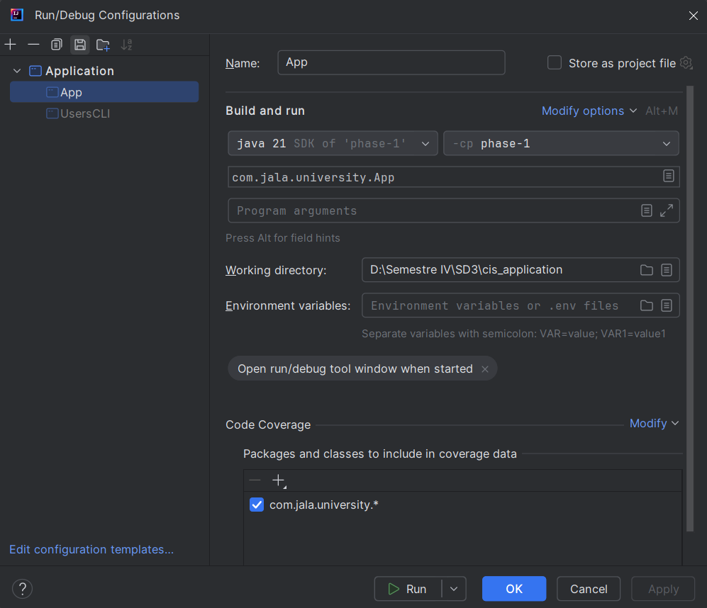

# Phase 1 - Legacy System Integration and Java Users API

## Introduction

This project focuses on developing a Crowdsourced Ideation Solution (CIS) that is compatible with an existing legacy system. The CIS is a platform for collective creativity where users can propose ideas and vote for the best ones.

## Project Overview

The Crowdsourced Ideation Solution (CIS) aims to integrate with a legacy CLI-based Java system and an existing MySQL database. Additionally, MongoDB can now be used as an alternative database for storing user data. This phase focuses on creating a modern user API that coexists with the legacy system while ensuring data consistency and security.


# Prerequisites:
- Maven 3.9.9 
- JDK 21

## Run project
By the moment, to run the project it's highly recommended to configurate the App launch in the Intellij Idea settings:



## Database Configuration

You can choose between using *MySQL* or *MongoDB* to store user data by setting the database.type property in the application's configuration file:

properties
# Use MySQL
database.type=mysql

# Use MongoDB
database.type=mongo


### MongoDB Setup

To use MongoDB as the database, ensure that:
- MongoDB is installed and running on your system or a remote server.
- You have configured the correct MongoDB connection string in the application properties.

### Example MongoDB connection string in application.properties:

properties
spring.data.mongodb.uri=mongodb://localhost:27017/your_database

## Maven dependency installation

If for some reason you editor doesn't install the dependencies or they aren't in the project, you can try this:

`mvn wrapper:wrapper`

And then try to run the `App.java`

Try to make sure you have maven already installed. You can check this with:

`mvn --version`

## Database Configuration

You can choose between using *MySQL* or *MongoDB* to store user data by setting the database.type property in the application's configuration file:

### properties
- Use MySQL: database.type=mysql
- Use MongoDB: database.type=mongo


### MongoDB Setup

To use MongoDB as the database, ensure that:
- MongoDB is installed and running on your system or a remote server.
- You have configured the correct MongoDB connection string in the application properties.


# Users API Documentation

## Authentication

To access the API, you need to provide the following credentials using Basic Authentication:

```
Username: root
Password: root
```

## GET /api/users

Retrieves a list of all users.

### Request

- Method: GET
- URL: `http://localhost:4000/api/users`

### Response

#### Successful Request (200 OK)

```json
[
  {
    "id": "user_id_1",
    "name": "User Name 1",
    "login": "user_login_1",
    "password": "hashed_password_1"
  },
  {
    "id": "user_id_2",
    "name": "User Name 2",
    "login": "user_login_2",
    "password": "hashed_password_2"
  }
]
```

## POST /api/users

Creates a new user.

### Request

- Method: POST
- URL: `http://localhost:4000/api/users`
- Content-Type: application/json

#### Request Body

```json
{
  "name": "New User",
  "login": "new_user_login",
  "password": "new_user_password"
}
```

### Response

#### Successful Creation (200 OK)

```json
{
  "id": "generated_user_id",
  "name": "New User",
  "login": "new_user_login",
  "password": "hashed_password"
}
```

## GET /api/users/{id}

Retrieves a specific user by ID.

### Request

- Method: GET
- URL: `http://localhost:4000/api/users/{id}`

### Response

#### Successful Request (200 OK)

```json
{
  "id": "requested_user_id",
  "name": "User Name",
  "login": "user_login",
  "password": "hashed_password"
}
```

#### User Not Found (404 Not Found)

No body returned for this status.

## GET /api/users/login/{login}

Retrieves a specific user by login.

### Request

- Method: GET
- URL: `http://localhost:4000/api/users/login/{login}`

### Response

#### Successful Request (200 OK)

```json
{
  "id": "user_id",
  "name": "User Name",
  "login": "requested_login",
  "password": "hashed_password"
}
```

#### User Not Found (404 Not Found)

No body returned for this status.

## PUT /api/users/{id}

Updates an existing user's information.

### Request

- Method: PUT
- URL: `http://localhost:4000/api/users/{id}`
- Content-Type: application/json

#### Request Body

```json
{
  "name": "Updated Name",
  "login": "updated_login",
  "password": "updated_password"
}
```

### Response

#### Successful Update (200 OK)

```json
{
  "id": "user_id",
  "name": "Updated Name",
  "login": "updated_login",
  "password": "updated_password"
}
```

#### User Not Found (404 Not Found)

No body returned for this status.

## DELETE /api/users/{id}

Deletes an existing user's information

### Request

- Method: DELETE
- URL: `http://localhost:4000/api/users/{id}`

### Response

#### Successful Update (200 OK)

```json
{
  "message": "User deleted successfully"
}
```

#### User Not Found (404 Not Found)
```json
{
  "message": "User not found"
}
```

### Notes

- All fields in the request body are optional for PUT. Only the provided fields will be updated.
- The user's ID cannot be changed.
- Updates are immediately reflected in the system.
- For security reasons, consider not returning the password field in responses, even if it's hashed.
