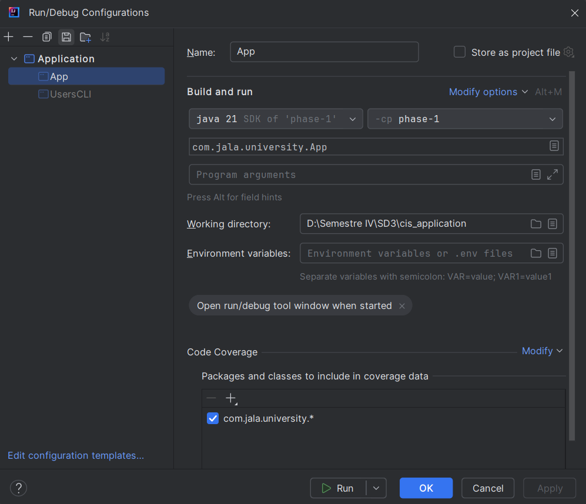

# PHASE 1

# Prerequisites:
- Maven 3.9.9 
- JDK 21

## Run project
By the moment, to run the project it's highly recommended to configurate the App launch in the Intellij Idea settings:

## Maven dependency installation

If for some reason you editor doesn't install the dependencies or they aren't in the project, you can try this:

`mvn wrapper:wrapper`

And then try to run the `App.java`

Try to make sure you have maven already installed. You can check this with:

`mvn --version`